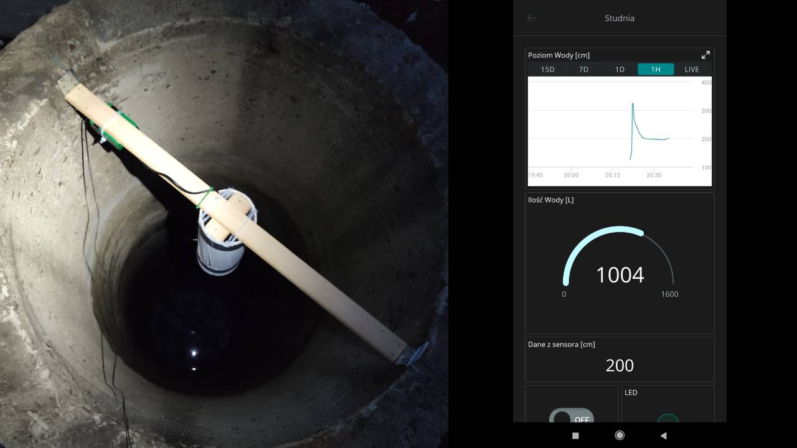

**Author** [mszjakub](https://github.com/mszjakub)

**Email** mszjakub.dev@gmail.com

**Date** 15/05/2023

**License** Public Domain

# Project: Water Well Observatory

The key idea of this project is to measure and monitor liquid level in concrete pipe (water well) and provide proper data in accessible form. For my curiosity.

ESP8266 WeMos D1 Mini board sends data to Arduino IoT Cloud from DFRobot A02YYUW waterproof ultrasonic distance sensor.

## Folder structure

```
waterwell-A02YYUW => Arduino sketch folder

├── WaterWell.ino => main Arduino file
├── thingProperties.h => Code generated by Arduino IoT Cloud
├── arduino_secrets.h => holds your network data
├── sketch.json
├── layout.jpg => an image of the layout
├── mount.jpg => an image of the probe mount
└── README.md => this file
```

## BOM

Materials you need for this project.

| ID  |         Part name          |                                      Part number                                      | Quantity |
| :-- | :------------------------: | :-----------------------------------------------------------------------------------: | -------: |
| S1  | Ultrasonic distance sensor | [A02YYUW](https://wiki.dfrobot.com/_A02YYUW_Waterproof_Ultrasonic_Sensor_SKU_SEN0311) |        1 |
| A1  | ESP8266 development board  |            [WeMos D1 Mini](https://www.wemos.cc/en/latest/d1/d1_mini.html)            |        1 |
| P1  |        Power Supply        |                                                                                       |        1 |

## Step 1: Assemble the circuit

To connect A02YYUW to WeMos D1 Mini board, D1/D2 digital pins can be used as RX/TX.
Assemble the circuit following the diagram layout.jpg


## Step 2: Installation

Set up Arduino IoT Cloud to send data between an ESP8266 development board and the Arduino Cloud IoT.

-   Open [Arduino IoT Cloud](https://create.arduino.cc/iot/) online platform
-   Add and set up your **Device** as _3rd Party device_
-   Create new **Thing**
    -   Associate Device
    -   Add Cloud variables
-   Add your network credentials in the network section (_network name_, _network password_ and _secret key_)
-   Program the board
    -   go to the "Sketch" tab
    -   use [WaterWell.ino](./WaterWell.ino) code
    -   edit sketch as you like ([adjustments](#adjustments))
    -   upload the code on to your board
-   Create your own Dashboard
    -   Add widgets (_Gauge_, _Chart_ or _Value_)
    -   Link Cloud variables

Here's a [more detailed tutorial](https://docs.arduino.cc/arduino-cloud/getting-started/esp-32-cloud) if needed.

# Adjustments

## Tank Parameters

My Water Well is made of 5 concrete rings, 800mm wide and 800mm high each.

To adjust this code for different well dimensions, set your own values of arguments passing to `calculateVolume` function.

```ino
//Defined Water Well dimensions [cm]
float waterWellRadius = 40;
float waterWellDepth = 400;
```

```ino
calculateVolume(calculatedDistance, waterWellDepth, waterWellRadius);
```

## Different board pins

If using different pins on your board for the sensor, you might need to change RX TX pins definitions in code.

```ino
// Defined pins used by A02YYUW ultrasonic sensor
#define rxPin D1 //green
#define txPin D2 //blue

SoftwareSerial Sensor (rxPin, txPin);
```

The list of output pins to identifiers are as follows, taken from the [source code](https://github.com/esp8266/Arduino/blob/master/variants/d1_mini/pins_arduino.h#L49-L61):

| Labelled WeMos Pin Number | Arduino Pin Number constant to use | “Real” Microcontroller Pin Number |
| :-----------------------: | :--------------------------------: | :-------------------------------: |
|       Digital Pin 0       |                 D0                 |                16                 |
|       Digital Pin 1       |                 D1                 |                 5                 |
|       Digital Pin 2       |                 D2                 |                 4                 |
|       Digital Pin 3       |                 D3                 |                 0                 |
|       Digital Pin 4       |                 D4                 |                 2                 |
|       Digital Pin 5       |                 D5                 |                14                 |
|       Digital Pin 6       |                 D6                 |                12                 |
|       Digital Pin 7       |                 D7                 |                13                 |
|       Digital Pin 8       |                 D8                 |                15                 |
|            TX             |                 TX                 |                 1                 |
|            RX             |                 RX                 |                 3                 |

# Fieldwork

Sensor was placed on top of well, under its cover. A power supply used to provide electric power to the board was AC adapter and USB cable. WiFi coverage around the well was also provided.

> :warning: Because of probe sensing angle 60° it was necessary to build a waveguide to block any echoes that aren't perpendicular to the sensor. I find [this article](https://www.apgsensors.com/about-us/blog/how-to-make-a-standpipe-and-wave-guide-for-your-ultrasonic-sensor) helpful.

> _Tip: I wrapped the pvc pipe with bandages for better wave absorption._



# Other useful links

[Pin numbering for WeMos D1 Mini (ESP8266)](https://chewett.co.uk/blog/1066/pin-numbering-for-wemos-d1-mini-esp8266/)

[How to make a standpipe and wave guide for your ultrasonic sensor](https://www.apgsensors.com/about-us/blog/how-to-make-a-standpipe-and-wave-guide-for-your-ultrasonic-sensor)
